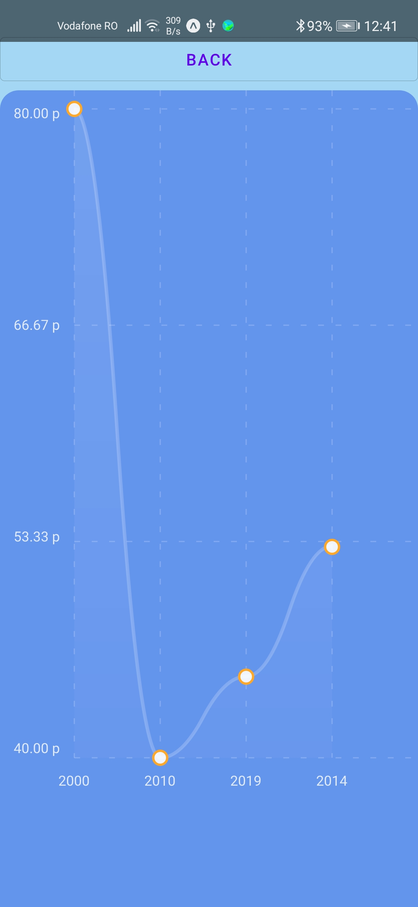

# Vibe

## Table of contents
* [Description](#Description)
* [Installation](#Installation)
* [Visuals](#Visuals)
* [Technologies](#Technologies)
* [Licence](#Licence)

## Description

Vibe it's a music player developed in React Native, based on Spotify API.  
Reference to **Spotify for Developers**: https://developer.spotify.com/documentation/web-api/ 

## Installation

### Local Server
- In order to start the mock server, you have to run **start-express-server.bat**. The node server will start locally, on 7005 port. 

### Mobile application
- **Change the IP**: Go to *app\src\main\java\com\mp\vibe\Utils\Constants.kt* and change the value of constant *ACCOUNT_BASE_URL* with your local IP. Make sure that the mobile  phone that you are using is in the same network with you computer, on which the server is running.
- **Install the app**: Copy the **vibe-debug-app.apk** on your phone in order to 
install the application. 

### Spotify account
- Make sure that you have the Spotify application installed on your phone, and 
that you are connected on a valid premium account (that will let you to change the songs from the Vibe application).

## Visuals
  

 

## Technologies
- React Native
- Spotify android-sdk 0.6.0

## Licence
MIT License

